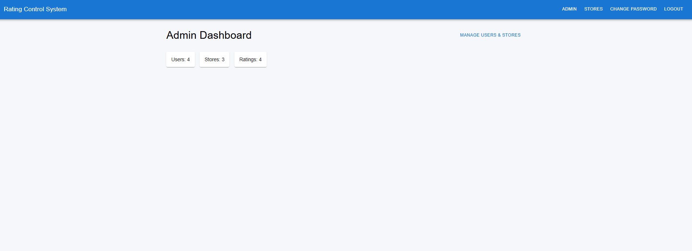
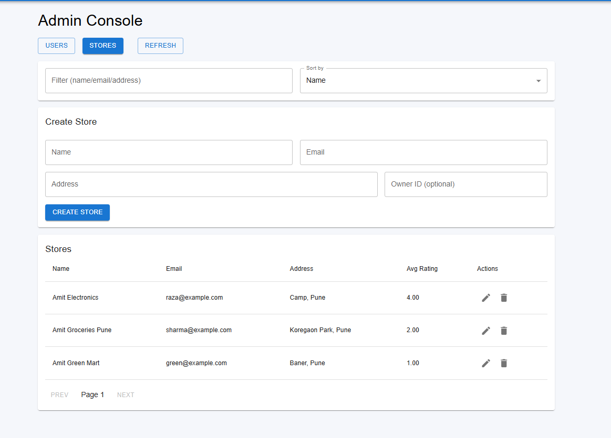
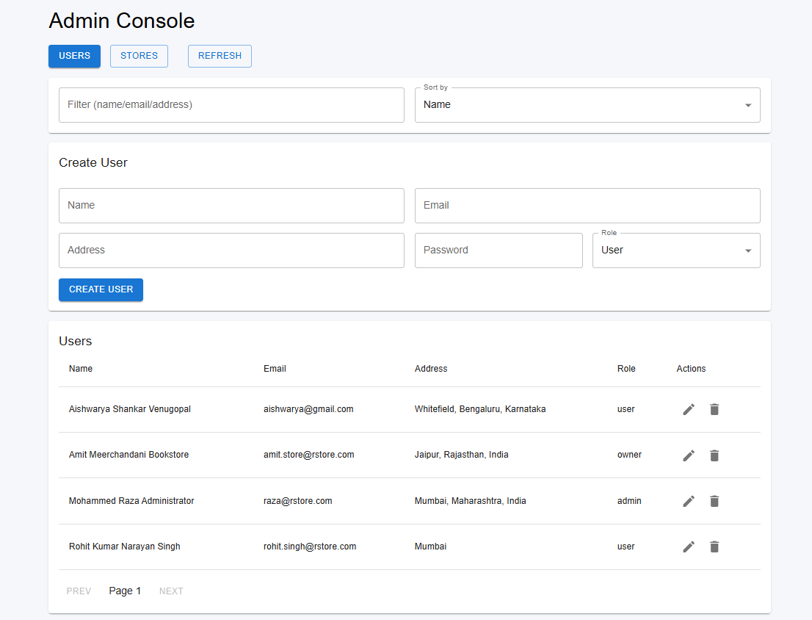
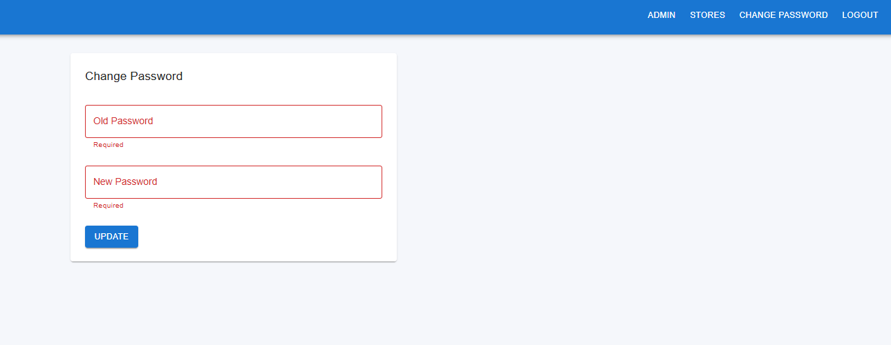
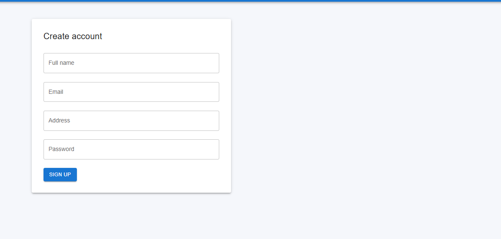
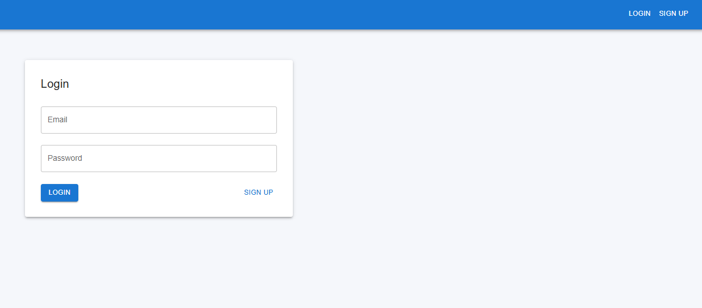
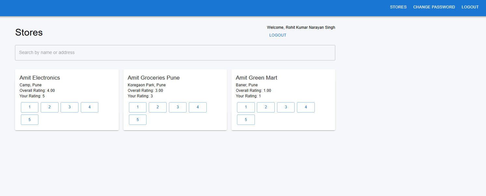
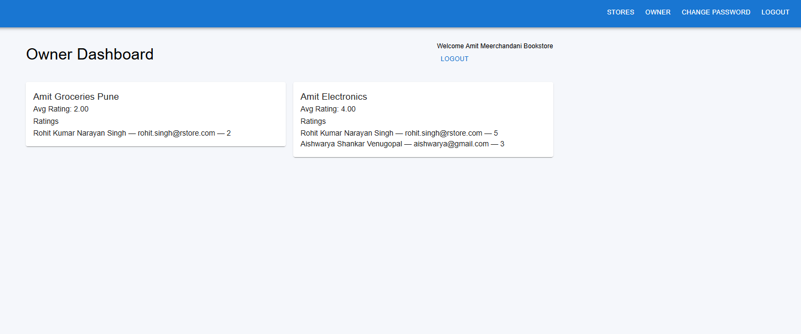

# ⭐ Rating Control System

**Fullstack Web App – Express.js + MySQL + React**

A complete role-based rating platform where Admins, Store Owners, and Normal Users can interact based on permissions. This system allows users to rate stores, store owners to analyze ratings, and admins to manage the entire system.

## 📁 Project Structure

```
rating-control-system/
│
├── backend/                          # Express + MySQL
│   ├── src/
│   ├── scripts/                      # Here you can create your initial credentials for admin, owner, user
│   └── .env.template                  # Template for environment variables
│
└── frontend/                         # React
    ├── src/
    └── public/
```

## 🚀 Features

### 👑 Admin

- Add stores, normal users, and admins
- **Dashboard:**
  - ✓ Total users
  - ✓ Total stores
  - ✓ Total ratings
- **View, filter, and sort:**
  - Users (Name, Email, Address, Role)
  - Stores (Name, Email, Address, Rating)
- Edit/Delete users and stores
- View user details
- Logout

### 👤 Normal User

- Sign up & login
- Update password
- View all stores
- Search by name/address
- Submit/Edit ratings (1–5)
- See personal submitted rating per store
- Logout

### 🏬 Store Owner

- Login
- Update password
- **Dashboard:**
  - Average store rating
  - List of users who rated their store
- Logout

## 🧪 Form Validation Rules

| Field    | Rule                                    |
| -------- | --------------------------------------- |
| Name     | 20–60 characters                        |
| Address  | Max 400 characters                      |
| Password | 8–16 chars, 1 uppercase, 1 special char |
| Email    | Must be valid                           |

## 🛠 Tech Stack

### Backend

- Node.js
- Express.js
- MySQL
- Sequelize ORM
- JWT Authentication
- bcryptjs

### Frontend

- React.js
- Material UI
- Axios
- React Router DOM

## 📦 Getting Started

Follow these commands to run the project locally.

### 🔧 1) Backend Setup

Navigate to backend folder:

```bash
cd backend
```

Install dependencies:

```bash
npm install
```

**Setup environment variables:**

A `.env.template` template is provided. Copy it and rename:

```bash
cp .env.template .env
```

Now open `.env` and fill your own credentials:

```env
DB_HOST=your_db_host_name
DB_PORT=your_db_port_number
DB_USER=your_db_user_name
DB_PASS=your_mysql_password
DB_NAME=rating_platform
JWT_SECRET=your_secret_key
PORT=5000
```

Start backend (development mode):

```bash
npm run dev
```

Inital database (Admin + Store Owner + Sample Users):

```bash
npm run demo_data
```

### 🖥️ 2) Frontend Setup

Navigate to frontend folder:

```bash
cd frontend
```

Install dependencies:

```bash
npm install
```

Start frontend:

```bash
npm start
```

**URLs:**

- Frontend: `http://localhost:3000`
- Backend: `http://localhost:5000`

## 🌐 API Base URL

Frontend communicates with backend using:

```
http://localhost:5000/api
```

## 📸 Screenshots

Below are screenshots that illustrate the Rating Control System

### 📊 Admin Screenshots

- **Admin Dashboard:** Summary view displaying Total Users, Total Stores, and Total Ratings with quick navigation to manage users and stores.

  

- **Store Management:** Lists all stores with Name, Email, Address, and Rating. Admins can create, edit, or remove stores.

  

- **User Management:** Displays all users with Name, Email, Address, and Role (admin or normal). Includes filtering and search controls. Admins can create new users, store owners, and additional admins.

  

- **Change Password:** Form allowing administrators to update their password after logging in.

  

---

## 👥 Normal User Screenshots

- **Signup Page:** Signup form for new users with fields for Name, Email, Address, and Password.

  

- **Login Page:** Authentication screen for all the users to log in and access the platform.

  

- **Stores Dashboard (for user) :** Displays all registered stores with Name, Address, and Overall Rating. Shows the user's submitted rating (if any) and provides controls to search by Name/Address and submit or modify ratings (1–5 scale).

  

## 🏷️ Store Owner Screenshots

- **Owner Dashboard:** Displays the average rating for the store and lists users who have submitted ratings, with links to view individual rating details.

  

## 🏁 Final Notes

This project follows:

- ✓ MVC Architecture (Backend)
- ✓ Role-based authentication & protected routes
- ✓ Modern UI with Material UI
- ✓ Clean code structure
